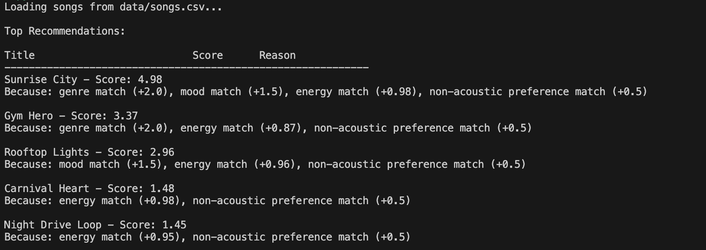
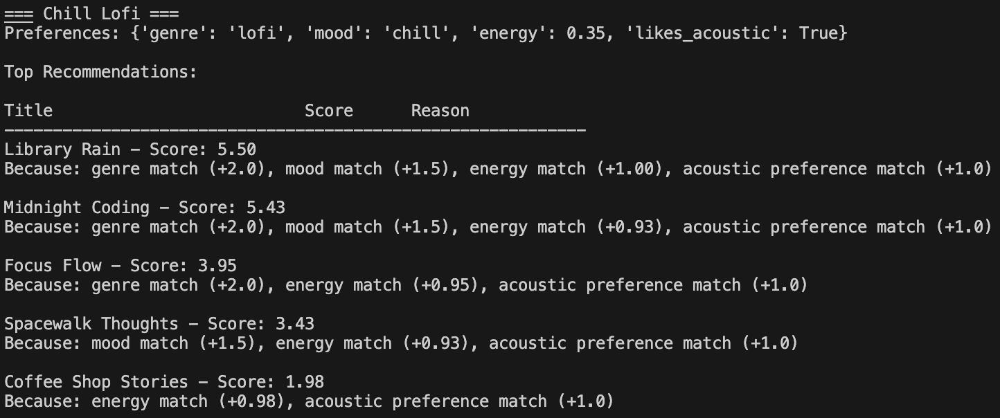
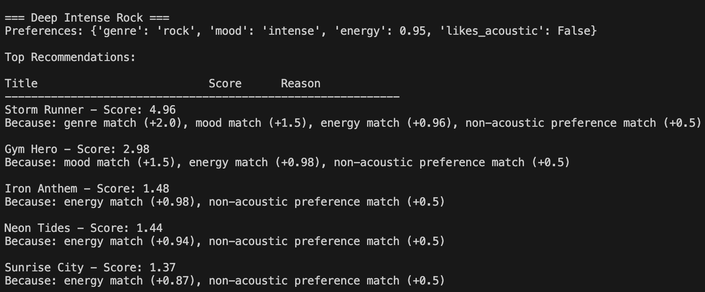
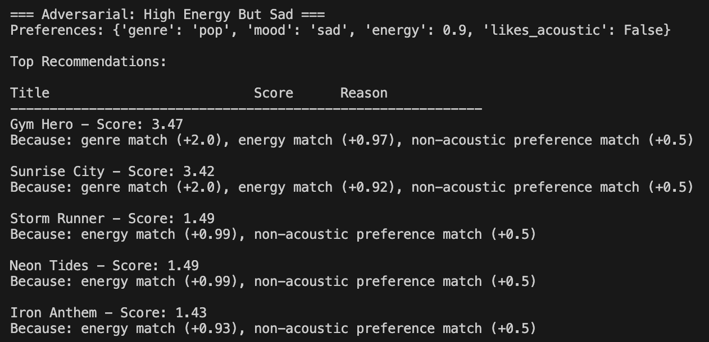
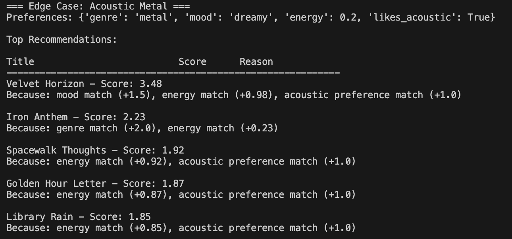

# 🎵 Music Recommender Simulation

## TF Reflection

This content matters because recommender systems shape how people discover music, videos, news, and even ideas. A small classroom simulation like this makes the hidden logic behind those systems much easier to see. Instead of treating AI as magic, students can break recommendation behavior into features, weights, tradeoffs, and failure cases. That is an important step toward building technical confidence and stronger judgment about where AI helps, where it oversimplifies, and where it can introduce bias.

As a TF, I think I could help students most by translating the project into clear decision points: what data the model uses, why a certain score goes up or down, and how a "working" system can still produce weak recommendations. I would also learn from seeing the different ways students define taste, fairness, and explainability. Their experiments and edge cases would reveal how many reasonable design choices exist in AI systems, and that kind of discussion would make me a better teacher and a more careful builder.

## Project Summary

This project builds a transparent music recommender over a small song catalog. The system compares each song against a user taste profile, scores matches on genre, mood, energy, and acousticness, then returns the top recommendations with short explanations for why they ranked well.

---

## How The System Works

This recommender uses a simple rule-based scoring system instead of learned behavior. Each song earns points when it lines up with the user's stated preferences.

Features used in the simulation:

- `Song` stores `id`, `title`, `artist`, `genre`, `mood`, `energy`, `tempo_bpm`, `valence`, `danceability`, and `acousticness`.
- `UserProfile` stores `favorite_genre`, `favorite_mood`, `target_energy`, and `likes_acoustic`.

Scoring recipe:

- Add `+2.0` for a genre match.
- Add `+1.5` for a mood match.
- Add up to `+1.5` based on how close song energy is to the user's target energy.
- Add `+0.5` if the song matches the user's acoustic preference.

For energy, the model uses closeness:

```python
energy_score = 1.5 * max(0.0, 1.0 - abs(target_energy - song_energy))
```

That means songs closer to the target energy get more credit, while songs far away get less.

---

## Getting Started

### Setup

1. Create a virtual environment if you want:

```bash
python -m venv .venv
source .venv/bin/activate
```

2. Install dependencies:

```bash
pip install -r requirements.txt
```

3. Run the app:

```bash
python -m src.main
```

### Running Tests

```bash
python -m pytest
```

### Example Output



Additional profile runs:

#### Chill Lofi



#### Deep Intense Rock



#### Adversarial: High Energy But Sad



#### Edge Case: Acoustic Metal



---

## Experiments You Tried

I compared five profiles: High-Energy Pop, Chill Lofi, Deep Intense Rock, Adversarial: High Energy But Sad, and Edge Case: Acoustic Metal.

- High-Energy Pop and Deep Intense Rock both favored energetic tracks, but genre matching helped push rock songs like `Storm Runner` higher for the rock listener.
- Chill Lofi consistently surfaced quieter and more acoustic songs like `Library Rain` and `Midnight Coding`.
- The adversarial profile showed a weakness: high energy often dominated the ranking even when the requested mood was sad.
- The acoustic metal edge case showed that unusual combinations can pull the recommender toward partial matches instead of truly satisfying results.

---

## Limitations and Risks

- The dataset is tiny, so many tastes are missing or underrepresented.
- High-energy songs can appear too often because energy is a strong signal in the score.
- Exact mood labels are rigid and do not capture subtle overlap between moods.
- The recommender does not learn from behavior over time, so it cannot adapt to changing preferences.

More detail is included in [model_card.md](model_card.md).

---

## Reflection

This project helped me understand how recommendation systems turn human preferences into numbers. Even with only a few rules, the model can produce outputs that feel personalized, which shows why recommenders are so powerful in real products. At the same time, building the scoring logic made it obvious that every weight is a design choice. If one feature is rewarded too much, the system can feel repetitive or misleading even when it is technically behaving as programmed.

It also changed how I think about fairness and bias in recommender systems. Bias does not only come from bad intent; it can also come from a small dataset, overly simple labels, or a scoring rule that favors one kind of user more than another. Human judgment still matters because someone has to decide whether the recommendations actually make sense, whether they are diverse enough, and whether the system is treating unusual preferences with care instead of flattening them.
